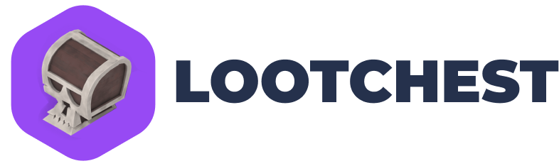
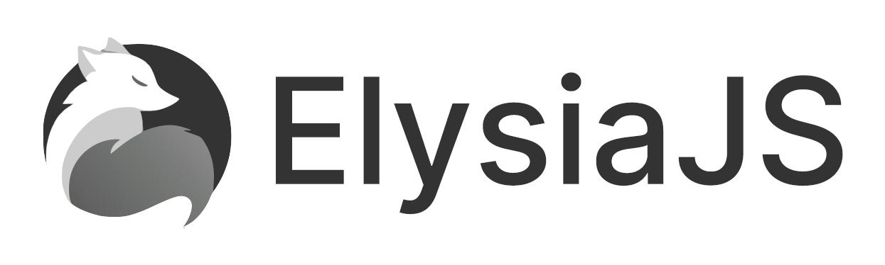

<a name="readme-top"></a>

[![LinkedIn][linkedin-shield]][linkedin-url]

<br />
<div align="center">
  <a href="https://lootchest.lol/">
    
  </a>

  <p align="center">
    The backend powering the chest opening exerpience
    <br />
    <br />
    <a href="https://lootchest.lol/">View Site</a>
    ·
    <a href="https://github.com/vinnyhoward/loot-chest/issues">Report Bug</a>
    ·
    <a href="https://github.com/vinnyhoward/loot-chest/issues">Request Feature</a>
  </p>
</div>

<details>
  <summary>Table of Contents</summary>
  <ol>
    <li>
      <a href="#about-the-project">About The Project</a>
      <ul>
        <li><a href="#built-with">Built With</a></li>
      </ul>
    </li>
    <li>
      <a href="#getting-started">Getting Started</a>
      <ul>
        <li><a href="#prerequisites">Prerequisites</a></li>
        <li><a href="#installation">Installation</a></li>
      </ul>
    </li>
    <li><a href="#usage">Usage</a></li>
    <li><a href="#roadmap">Roadmap</a></li>
    <li><a href="#license">License</a></li>
    <li><a href="#contact">Contact</a></li>
    <li><a href="#acknowledgments">Acknowledgments</a></li>
  </ol>
</details>

## About The Project

<a href="https://github.com/othneildrew/Best-README-Template">

</a>

The frontend may capture the imagination with its 3D chest-opening experience, but it's the backend architecture that ensures this interactive adventure runs smoothly. Engineered for high performance and scalability, the backend framework supports a seamless user experience, managing game logic, content updates, and user data with efficiency.

Key Highlights:
* **Robust Data Management:** Leveraging Prisma alongside PostgreSQL, the backend adeptly handles complex data operations, guaranteeing data integrity and seamless access to game content and user progress.
* **Scalable Architecture:** Designed with future growth in mind, the architecture utilizes Docker for containerization, facilitating easy scalability as user demand grows.
* **Secure Authentication:** Advanced security measures are in place for managing user authentication and protecting data, ensuring a secure environment for all users.
* **Dynamic Content Delivery:** With Sanity.io, content updates and game asset management can occur in real-time, maintaining a fresh and engaging user experience.
* **High-Performance Framework:** Powered by Elysia, the backend enjoys fast response times and smooth interactions, catering to users worldwide with efficiency.
* **Modern Development Tools:** Embracing TypeScript for its type safety and Bun.js for its execution speed, the development process is both streamlined and efficient, fostering rapid iteration and deployment.

The backend's robust and dynamic platform underpins the chest-opening adventure, equipped with leading technologies to ensure a stable and evolving journey for the user community.

### Built With

This backend leverages a stack designed for robustness, scalability, and ease of development. Here's what makes it tick:

* [![Typescript][Typescript]][ts-url] - TypeScript brings static typing to JavaScript, enhancing code quality and developer productivity through its powerful type system and compilation for error-checking.

*  - Elysia is a high-performance, scalable framework for building efficient and secure APIs, offering out-of-the-box support for modern web standards.

* [![Prisma][Prisma]][prisma-url] - Prisma is an open-source ORM for Node.js and TypeScript, making database access easy with its auto-generated and type-safe query builder, simplifying data management and migrations.

* [![Postgres][Postgres]][postgres-url] - PostgreSQL is a powerful, open-source object-relational database system that uses and extends the SQL language combined with many features to safely store and scale the most complicated data workloads.

* [![Sanity.io][Sanity.io]][sanity-url] - Sanity.io provides a structured content management platform, enabling seamless collaboration on content editing and offering a source of truth for all forms of digital content.

* [![Docker][Docker]][docker-url] - Docker simplifies deployment by allowing the application and its environment to be packaged as containers, ensuring consistency across various development and production settings.

* [![Bun.js][Bun.js]][bun-url] - Bun.js is a modern JavaScript runtime like Node.js but focuses on offering better performance and a more comprehensive package manager, making development workflows faster and more efficient.

By combining these technologies, the backend architecture ensures a solid foundation for developing and scaling the chest-opening platform, focusing on performance, security, and developer experience.


<p align="right">(<a href="#readme-top">back to top</a>)</p>

## Getting Started

To set up this project locally and explore the immersive 3D chest-opening experience, follow these steps.

### Prerequisites

Ensure you have either Node.js or Bun installed on your system to manage project dependencies and run the development server.

- For Node.js, download and install it from [nodejs.org](https://nodejs.org/).
- For Bun, you can install it by running the following in your terminal (visit [bun.sh](https://bun.sh/) for more details):

```sh
curl https://bun.sh/install | bash
```

## Installation

1. Clone the repository to get a local copy of the project:

```sh
git clone https://github.com/vinnyhoward/loot-chest-backend.git
cd loot-chest-backend
```

2. Install dependencies using either npm (Node.js) or Bun. Choose the command based on your preference:

Using npm:

```sh
npm install
```

Using Bun:

```sh
bun install
```

3. Configure environment variables by creating a .env file in the root directory of the project. Fill it with your specific values based on the provided .env template:

```makefile
DATABASE_URL=<database_url>
SANITY_PROJECT_ID=<sanity_project_id>
SANITY_DATASET=<sanity_dataset>
SANITY_SECRET_TOKEN=<sanity_secret_token>
PORT=<port>
JWT_SECRETS=<jwt_secret>
JWT_NAME=<jwt_name>
MAILERSEND_API_KEY=<mailersend_api_key>
SITE_URL=<site_url>
```
Ensure to replace placeholder values with your actual settings. These values are critical for the proper operation of your application.

4, **Prisma Setup:** After installing your dependencies, run the following Prisma commands to set up your database schema, validate it, format it for readability, and apply the changes to your database:

```sh
bun prisma generate
bun prisma validate
bun prisma format
bun prisma db push
```

These commands help generate the Prisma client based on your schema, validate the schema, format it properly, and push the schema changes to your database, creating the necessary tables.

5. Utilize Docker for environment consistency (optional but recommended):

- If you haven't installed Docker and Docker Compose yet, follow the instructions on Docker's official website.

- To build and run your application in a Docker container, execute:

```sh
docker-compose up --build
```

This command starts your application and database services as defined in `docker-compose.yml`. Your backend should now be accessible at `http://localhost:3000/` or another port if specified differently in your `.env` file and Docker configuration.

6. Run the development server locally without Docker:

Using npm:

```sh
npm run dev
```

Using Bun:

```sh
bun run dev
```

Access the application by navigating to `http://localhost:<port>/` in your web browser, replacing `<port>` with the port number you've specified in your `.env` file.

You're now set to dive into the backend development, supporting the dynamic and engaging 3D chest-opening experience. Happy coding!

<p align="right">(<a href="#readme-top">back to top</a>)</p>

## Usage

This backend server is designed to work seamlessly with its corresponding frontend and provides a comprehensive API for managing the chest-opening experience. You can interact with the server in two primary ways:

### Running the Server Locally

1. **Ensure the Installation Steps are Completed**: Before running the server, make sure you've followed the [Installation](#installation) steps to set up the project and its dependencies on your local machine.

2. **Start the Server**: Use the command appropriate for your package manager to start the server:
   - With npm:
     ```sh
     npm run dev
     ```
   - With Bun:
     ```sh
     bun run dev
     ```

   This command initializes the development server and watches for any changes to the TypeScript files, recompiling and restarting the server as needed.

3. **Access the API**: With the server running, you can access the API endpoints through `http://localhost:<port>`, where `<port>` is the value you've set in your `.env` file (default is usually 3000).

### Using the Postman Collection

For those who prefer to test and interact with the API via a graphical interface, a Postman collection is provided:

1. **Download Postman**: If you haven't already, download and install Postman from [their official site](https://www.postman.com/downloads/).

2. **Import the Collection**: Download the [Postman collection](/assets/postman/loot_chest_api.postman_collection.json) and import it into Postman. This collection contains prepared requests for each endpoint of the API, making it easy to test and explore the available functionalities.

3. **Configure Environment Variables in Postman**: Ensure you set up Postman environment variables such as the API URL to point to your local server or the deployed version, depending on where you're running the backend.

By following these steps, you can effectively utilize the backend server either directly through your local setup or via Postman, allowing for a versatile and comprehensive testing and development workflow.


<p align="right">(<a href="#readme-top">back to top</a>)</p>

## Roadmap

- [ ] Forgot Password/Reset Password needs a expired token flow
- [ ] Welcome to Loot Chest email

<p align="right">(<a href="#readme-top">back to top</a>)</p>

## License

Distributed under the MIT License. See `LICENSE.txt` for more information.

<p align="right">(<a href="#readme-top">back to top</a>)</p>

## Contact

Vincent Howard - [@NiftyDeveloper](https://twitter.com/NiftyDeveloper) - vincenguyenhoward@gmail.com

Project Link: [https://github.com/vinnyhoward/loot-chest](https://github.com/vinnyhoward/loot-chest-backend)

<p align="right">(<a href="#readme-top">back to top</a>)</p>

[contributors-shield]: https://img.shields.io/github/contributors/othneildrew/Best-README-Template.svg?style=for-the-badge
[contributors-url]: https://github.com/othneildrew/Best-README-Template/graphs/contributors
[forks-shield]: https://img.shields.io/github/forks/othneildrew/Best-README-Template.svg?style=for-the-badge
[forks-url]: https://github.com/othneildrew/Best-README-Template/network/members
[stars-shield]: https://img.shields.io/github/stars/othneildrew/Best-README-Template.svg?style=for-the-badge
[stars-url]: https://github.com/othneildrew/Best-README-Template/stargazers
[issues-shield]: https://img.shields.io/github/issues/othneildrew/Best-README-Template.svg?style=for-the-badge
[issues-url]: https://github.com/othneildrew/Best-README-Template/issues
[license-shield]: https://img.shields.io/github/license/othneildrew/Best-README-Template.svg?style=for-the-badge
[license-url]: https://github.com/othneildrew/Best-README-Template/blob/master/LICENSE.txt
[linkedin-shield]: https://img.shields.io/badge/-LinkedIn-black.svg?style=for-the-badge&logo=linkedin&colorB=555
[linkedin-url]: https://www.linkedin.com/in/vinnyhoward/
[product-screenshot]: public/images/product_image.png
[Next.js]: https://img.shields.io/badge/next.js-000000?style=for-the-badge&logo=nextdotjs&logoColor=white
[Next-url]: https://nextjs.org/
[React.js]: https://img.shields.io/badge/React-20232A?style=for-the-badge&logo=react&logoColor=61DAFB
[React-url]: https://reactjs.org/
[Vue.js]: https://img.shields.io/badge/Vue.js-35495E?style=for-the-badge&logo=vuedotjs&logoColor=4FC08D
[Vue-url]: https://vuejs.org/
[Angular.io]: https://img.shields.io/badge/Angular-DD0031?style=for-the-badge&logo=angular&logoColor=white
[Angular-url]: https://angular.io/
[Svelte.dev]: https://img.shields.io/badge/Svelte-4A4A55?style=for-the-badge&logo=svelte&logoColor=FF3E00
[Svelte-url]: https://svelte.dev/
[Laravel.com]: https://img.shields.io/badge/Laravel-FF2D20?style=for-the-badge&logo=laravel&logoColor=white
[Laravel-url]: https://laravel.com
[Bootstrap.com]: https://img.shields.io/badge/Bootstrap-563D7C?style=for-the-badge&logo=bootstrap&logoColor=white
[Bootstrap-url]: https://getbootstrap.com
[JQuery.com]: https://img.shields.io/badge/jQuery-0769AD?style=for-the-badge&logo=jquery&logoColor=white
[JQuery-url]: https://jquery.com 
[Vite.js]: https://img.shields.io/badge/vite-%23646CFF.svg?style=for-the-badge&logo=vite&logoColor=white
[vite-url ]: https://vitejs.dev/
[Typescript]: https://img.shields.io/badge/typescript-%23007ACC.svg?style=for-the-badge&logo=typescript&logoColor=white
[ts-url ]: https://www.typescriptlang.org/
[Three.js]: https://img.shields.io/badge/threejs-black?style=for-the-badge&logo=three.js&logoColor=white
[three-url]: https://threejs.org/
[bun-url]: https://bun.sh/
[Bun.js]: https://img.shields.io/badge/bun-282a36?style=for-the-badge&logo=bun&logoColor=fbf0df
[Sanity.io]: https://img.shields.io/badge/Sanity.io-black?style=for-the-badge&logo=sanity&logoColor=white
[sanity-url]: https://www.sanity.io/
[Prisma]: https://img.shields.io/badge/Prisma-3982CE?style=for-the-badge&logo=Prisma&logoColor=white
[prisma-url]: http://prisma.io
[Postgres]: https://img.shields.io/badge/PostgreSQL-316192?style=for-the-badge&logo=postgresql&logoColor=white
[postgres-url]: https://www.postgresql.org/
[Docker]: https://img.shields.io/badge/Docker-2CA5E0?style=for-the-badge&logo=docker&logoColor=white
[docker-url]: https://www.docker.com/
